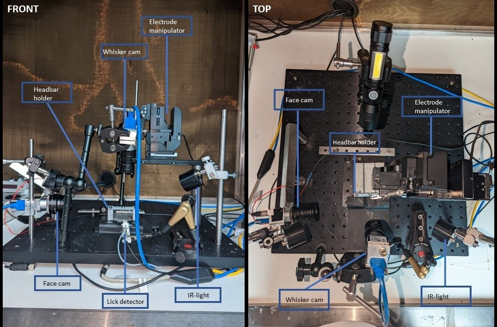

# Hardware setup for the "Microstimulation" experiment 

This repository provides information to set up the "Microstimulation" experiment used in Matthew Larkum's lab, including both *a documentation package of the hardware, the experimental protocol, and the software used for data acquisition* 
We will present here the most recent version which was reworked to use BPOD (Schutte et al. in preparation), we will also refer to the original setup described in (Doron et al., 2020).

In the microstimulation experiment, a *rodent* (usually a mouse) is head fixed. It receives *Intracranial Direct Current stimulation (IDCS)* or  *microstimulation* in the primary somatosensory barrel cortex (S1-BF). The goal of the task is to teach the animal to report the stimulus by licking a water spout during the response window. The animal usually learns to associate a 40 $\mu A$  stimulation with a sugar water (4% sucrose) reward and will lick the water tube upon stimulation. Both a BPOD and a SPIKE2 version of the setup and the protocol exist. 

## Current state of the project

The hardware can be defined as a prototype, as most self-assembled setups in neurobiology labs. Most components are not open source, and expensive. Note that things like the camera holder, rod-connector or head-bar holder can be found as 3D printable files from the [SimpleScienceSetup](https://github.com/mik-schutte/SimpleScienceSetup) project.

The current version uses [BPOD](https://sanworks.io/shop/products.php?productFamily=bpod) technology and [MATLAB](mathworks.com/campaigns/products/trials.html?gclid=CjwKCAiAmsurBhBvEiwA6e-WPC8ymdKjoKsw-h0QvnPUYUxUiHMEaFBh7Eg0xaEl5rYMuemgdsWKdBoC2_kQAvD_BwE&ef_id=CjwKCAiAmsurBhBvEiwA6e-WPC8ymdKjoKsw-h0QvnPUYUxUiHMEaFBh7Eg0xaEl5rYMuemgdsWKdBoC2_kQAvD_BwE:G:s&s_kwcid=AL!8664!3!462958882966!e!!g!!matlab%20download&s_eid=ppc_10961695282&q=matlab+download&gad_source=1) scripts, while the original setup used [CED 1401 and SPIKE2](https://ced.co.uk/products/spkovin). 

The goal of this repository is to provide a step-by-step guide for a non-engineer (neuroscientist) to create, build, implement and do experiments on the setup. The **future** of the project holds implementations for probe recordings, 2P-imaging and widefield imaging.

## Overview of the microstimulation setup

The microstimulation setup can be subdivided into several compartments:

* The [base setup](10_basesetup/base_readme.md): Components need to be brought together, everything needs to be grounded and vibration resistant. The elements should be hooked to the computer with possibly a good time synchronisation and cable management. Finally, micromanipulators should be positioned to maximize safe movement in the setup.

* The [animal restrains](11_animalrestrains/AR_readme.md): Headfixation and animal restrainment to allow for electrode insertion with limited discomfort. Positioning of the mouse holder should allow for flexibility for between-animal differences.

* The [water reward system](12_water-reward/WR_readme.md): The lick detector, the multitool, the solenoid, the tubing and the water container. Allowing for a quantified, timed and reliable distribution of the water reward.

* The [electrical compartment for stimulation and eventually recording](13_stimulation-recoding/stim_rec_readme.md): Comprised of the arduino pulse configurator, the stimulus isolator, the electrode, and the electrode holder. Together, they are used to generate an electrical stimulation that's emitted through the electrode.

* The [camera compartment](14_videorecording/vid_r_readme.md): Contains the cameras, the camera holders, the lenses, the infra-red and the UV-light. Collectively they allow for the recording of animal behaviour such as pupil dilation and whisker movement.

All compartments put together create a setup that should roughly look like this. 

## Description of repository content

This repository largely follows a similar structure as the setup. Each hardware compartment (see above) has their own folder with a README, a bill of materials, build instructions and a wiring diagram. This allows for a modular and more flexible setup that is necessary for easy adoption. 

You'll notice that sometimes a difference is made between version 0 and version 1. This means that there is a difference in this compartments laboratory interface. The laboratory interface is used to coordinate the experiments here it determines what to do with licking input, when to give a microstimulation and when to start saving frames. Version 0 corresponds to the SPIKE2 implementation and version 1 to the BPOD implementation.

## The Software

On top of the hardware documentation we also provide a software package for analysing behavioural and video data. All can be found on the GitHub page for [Microstimulation analysis](https://github.com/mik-schutte/Microstimulation). We have already created a notebook on how to perform analysis. We highly-reccomend checking it out for those with similar data.

## How to contribute 

If you have been reading until here, you can probably help us make this documentation better. Please contact us per email or via an issue in this repository, especially if you are using this documentation, if you have some comments or ideas for improvement, if you want to reuse this hardware for similar or dissimilar experiments or if you just want to say hello. 

## Acknowledgements

The core team members are Mik Schutte and Jelte de Vries. Both of us are employed by the Humboldt University and PhD-students in the Larkum lab and are being supervised by Dr. Robert Sachdev. Primary development was performed by Dr. Guy Doron and transferred by Moritz Druke. Data-management and the supervision concerning open source is done by Dr. Julien Colomb. Lastly, we thank the Delft Open Hardware Academy for its many valuable lessons in designing, project management and hardware documentation.

