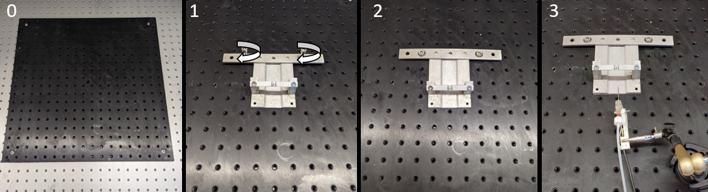

# Build instructions

## Before you begin

Please note the current state of the project.
Currently, we are hard at work to make new developments for the microstimulation setup. This creates makes it difficult to keep all the documentation up-to-date. The first improvement is the conversion from CED to BPOD. With this transition the component that drives the setup will be adjusted. However, the instructions below work with the CED and Multitool as noted in the Bill of Materials.

## Tools required 

In order to replicate the microstimulation setup you need the following tools:
- Flat head screwdriver
- Hex key
- ???

## Wiring diagram
Julien's wiring diagram here

## Material required

|Base|Animal Restraint|Water Reward|Stimulation|Video|
|----|----------------|------------|-----------|-----|
|Vibration table|
|6mm breadboard|     
|Hex screw (xmm?)|
|

## Animal component and reward system

Attache the headbar holder to the breadboard and connecting the lick detector to the multitool.

1. Place the headbar holder on the breadboard.
2. Screw in the 6mm hex screws to fasten the headbar holder.
3. Place the lick detector in front of the headbar holder.

5. Connect the lick detector with the multitool at PIEZO IN.
6. Connect Multitool TRIGGER OUT with the CED EVENT IN 0, using a BNC connector.
7. Connect Multitool SOLENOID IN with the CED DIGITAL OUT 0, using a BNC connector.
8. Connect Multitool SOLENOID OUT with the solenoid.
9. Connect the tubing from the water container to the spout of the lick detector.

![](pictures/build_ced_multi.png

If correctly configured you can now turn on the Multitool and gently tap the lick detector. There should be a light coming from TRIGGER OUT. If it doesn't try increasing the GAIN of the signal by turning the knob on the Multitool. 

Additionally, test if the solenoid is working by pressing the SOLENOID SETUP know. You should hear the solenoid opening with a click. If you have also filled your water container water should now be despensed from the licking spout.

## Electrical component

Set up the micromanipulator, attach electrode holder to the manipulator, connect the stimulus isolator to the CED and optionally clamp the electrode with the electrode holder and connect to the stimulus isolator.

1. Place your micromanipulator to the side of the headbar holder. Make sure that the holder can be reached by the manipulator. Note that an electrode will be attached and should safely hover over the headbar holder.
2. Connect CED EVENT IN 1 to CED DIGITAL OUT 1 using a BNC connector.
3. Connect CED DIGITAL OUT 1 to the stimulus isolator INPUT using a BNC connector.
4. Attach the electrode holder to the micromanipulator.
5. Clamp the electrode using the electrode holder. Be very carful during this step as the electrode is very delicate.
6. Connect the electrode to the stimulus isolator OUTPUT.

If correctly connected you can try testing the electrical compartment. Turn on the stimulus isolator and switch AUDIO to and OUTPUT to on. Turn on the CED and open the SPIKE2 script. Place the electrode in saline together with the grounding (red) wire. The SPIKE2 script should allow you to give a stimulus. You should see a light at CED EVENT IN 1 as well as hear a beep from the stimulus isolator.

## Camera component

Place the camera holders on the breadboard, mount the cameras to their holders and connect the cameras to the computer and the CED.

1. Position the camera holders at the angle of interest. The distance from the headbar holder depends on your camera and it's lense. You can use this STL file for determining the best position.
2. Mount the cameras to their holder.
3. Connect the cameras to your computer using the USB 3.0, Micro B sl/A cable.
4. Connect the cameras to the CED DAC OUT 0 using the Opto-GP-I/O Y cable. If you are using the supplied camera configuration GPIO 3 should be connecting the camera and the CED.
5. Connect CED DAC OUT 0 to CED ADC IN 3.

If succesful you can try out the cameras by opening up the Pylon recording software and selecting the supplied configuration file. Try giving a stimulus, if everything is connected properly frame aquisition should start.
